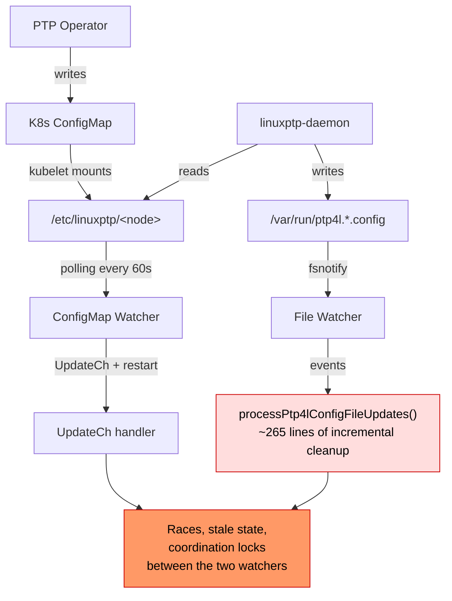
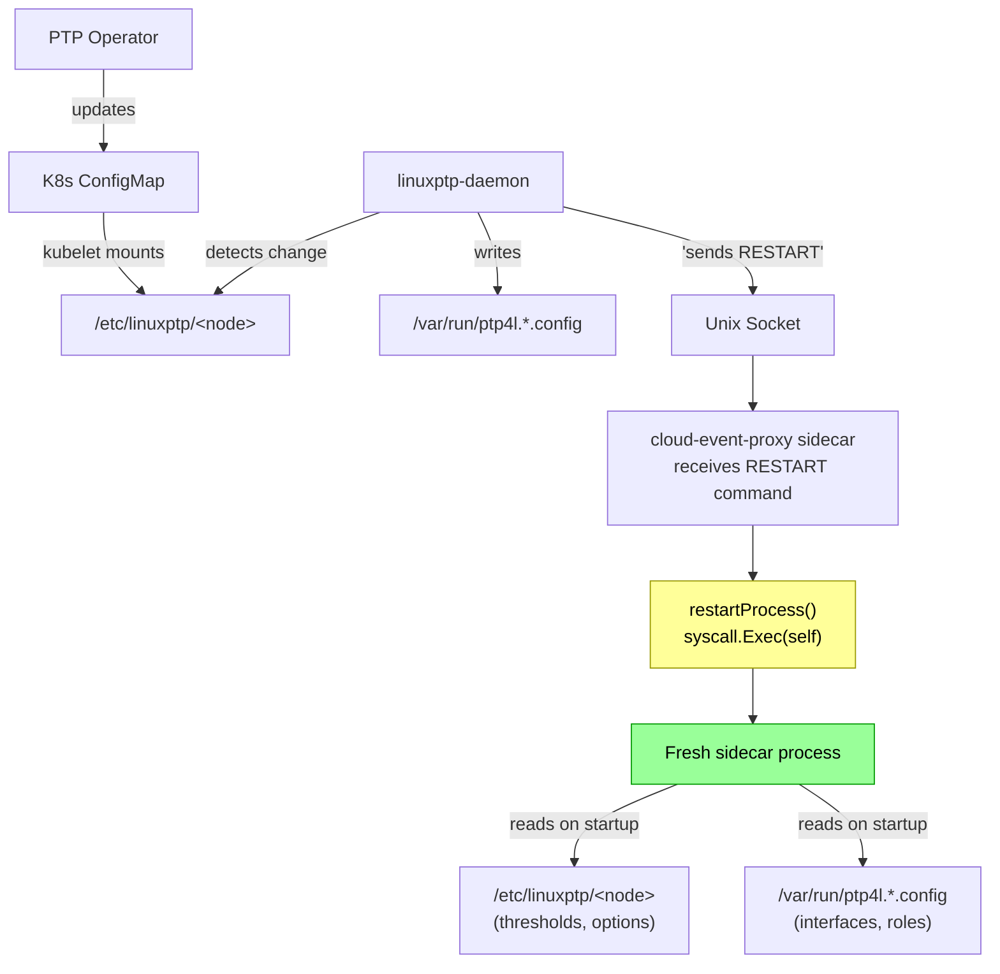

# Daemon-Controlled Sidecar Restart on Configuration Changes

## Table of Contents

- [Overview](#overview)
- [Problem Statement](#problem-statement)
- [Configuration Sources](#configuration-sources)
- [Solution Architecture](#solution-architecture)
- [Socket Protocol](#socket-protocol)
- [Implementation Changes](#implementation-changes)
- [Edge Cases](#edge-cases)
- [Testing Strategy](#testing-strategy)
- [Daemon-Side Requirements](#daemon-side-requirements)

---

## Overview

The cloud-event-proxy sidecar monitors PTP configuration and coordinates with the linuxptp-daemon to provide metrics and events. When configuration changes, the sidecar must reset its internal state (metrics, interface mappings, holdover goroutines, stats) to avoid stale-state bugs.

This document describes the solution: the **daemon controls sidecar restarts** by sending an explicit `CMD RESTART` command over the existing Unix socket. The sidecar exec's itself for a clean restart, then re-reads all configuration from disk on startup. No file watchers, no ConfigMap polling, no incremental cleanup.

---

## Problem Statement

### Issues with Sidecar-Driven Config Detection

The previous design has the sidecar independently watching for config changes via two mechanisms:



**Problems:**

1. **Stale state accumulation**: When PTP profiles are deleted and re-applied, the sidecar retains in-memory state (metrics, interface roles, holdover timers, stats) that becomes inconsistent with the new configuration.
2. **Complex incremental cleanup**: The code attempts to selectively clean up state when configs change, leading to ~400 lines of complex, error-prone logic in `processPtp4lConfigFileUpdates()`.
3. **Race conditions**: File watcher and ConfigMap watcher run independently. `FileWatcherUpdateInProgress` locks attempt coordination but don't fully resolve the races.
4. **Incomplete cleanup**: Some state (goroutines, cached values, metric labels) is difficult to clean up incrementally and leaks across config changes.

### Why Restart Instead of Cleanup?

Using `syscall.Exec` to restart the process provides:

- **Complete state reset**: All memory, goroutines, metrics, and cached values are cleared
- **Simplicity**: No need for complex cleanup logic
- **Reliability**: Equivalent to container restart but faster (no Kubernetes involvement)
- **No downtime**: Socket is cleanly closed and recreated; metrics endpoint remains available

---

## Configuration Sources

The sidecar reads configuration from two separate sources:

### 1. PTP Profile ConfigMap (Kubernetes ConfigMap)

| Aspect | Details |
|--------|---------|
| **Managed by** | PTP Operator Controller (Kubernetes) |
| **Location** | `/etc/linuxptp/<NODE_NAME>` (via `PTP_PROFILE_PATH` env var, default `/etc/linuxptp`) |
| **Format** | JSON file containing PTP profiles |
| **Contains** | Thresholds (`minOffsetThreshold`, `maxOffsetThreshold`, `holdOverTimeout`), process options (`ptp4lOpts`, `phc2sysOpts`, `ts2PhcOpts`, `chronydOpts`, `syncE4lOpts`), settings (HA profiles, T-BC controlling profiles) |
| **New behavior** | Read once on startup via `WatchConfigMapUpdate(keepAlive=false)` |

### 2. PTP4l Config Files (daemon-written)

| Aspect | Details |
|--------|---------|
| **Managed by** | linuxptp-daemon |
| **Location** | `/var/run/ptp4l.*.config`, `/var/run/phc2sys.*.config`, `/var/run/synce4l.*.config`, `/var/run/chronyd.*.config` |
| **Format** | INI-style config files |
| **Contains** | Interface lists, port configurations and roles (master/slave), process-specific settings |
| **New behavior** | Read once on startup via `loadInitialPtp4lConfigs()` |

**Key point**: These are two different things. The daemon monitors the ConfigMap (mounted file), and when it changes, the daemon reads it, generates new config files in `/var/run/`, and sends `CMD RESTART` to coordinate the sidecar reload.

---

## Solution Architecture

### Design Principles

**Single restart trigger.** The daemon is the single source of truth for when the sidecar should restart. The `CMD RESTART` socket command is the only trigger. The sidecar does not watch the ConfigMap or config files for changes.

**Atomic config reading on restart.** When the sidecar restarts via `syscall.Exec`, it re-reads all configuration atomically in `Start()`:
- ConfigMap (thresholds, process options, settings) from `/etc/linuxptp/<node>`
- Config files (interfaces, port roles) from `/var/run/ptp4l.*.config`

This guarantees consistent state: the ConfigMap and config files always match because the daemon writes them before sending `CMD RESTART`.

**Startup synchronization without handshake.** The daemon guarantees that config files are written before sending `CMD RESTART`. On initial startup, `loadInitialPtp4lConfigs()` may find no configs (graceful). Once the daemon writes configs and sends `CMD RESTART`, the sidecar restarts and reads them. No handshake protocol needed.

### Data Flow



### Steady-State Operation

Normal log processing is unchanged:


When the daemon decides a restart is needed, it sends a single `CMD RESTART` line on the same socket. The sidecar handles it inline in `processMessages()`.

### Restart Mechanism

The `restartProcess()` function replaces the current process with a fresh copy:

```go
func restartProcess(reason string) {
    log.Infof("configuration change detected (%s), restarting process for clean state...", reason)

    // Remove the Unix socket file so the new process can bind cleanly.
    if err := os.Remove(eventSocket); err != nil && !os.IsNotExist(err) {
        log.Warningf("failed to remove socket file %s: %v", eventSocket, err)
    }

    binary, err := os.Executable()
    if err != nil {
        log.Fatalf("failed to get executable path for restart: %v", err)
    }

    log.Infof("restarting: %s %v", binary, os.Args)
    if err := syscall.Exec(binary, os.Args, os.Environ()); err != nil {
        log.Fatalf("failed to restart process: %v", err)
    }
}
```

Key characteristics:
- Uses `syscall.Exec` to replace the current process (PID preserved, all state cleared)
- Preserves command-line arguments and environment variables
- Cleans up socket file before exec so the new process can bind
- Never returns (process image is replaced)

---

## Socket Protocol

The existing socket at `/cloud-native/events.sock` sends one line per message. All existing messages are log lines with the format `processName[timestamp]:[config] payload`. We add a **control command** with a distinct `CMD` prefix that cannot collide with log lines:

```
CMD RESTART
```

Any line that equals exactly `CMD RESTART` triggers `restartProcess()`. All other lines are passed to `ExtractMetrics()` as before.

The `CMD` prefix is chosen because:
- All existing log lines start with a process name (`ptp4l`, `phc2sys`, `ts2phc`, `GM`, `T-BC`, etc.). `CMD` is not a process name and will never appear as stdout from any PTP process.
- The daemon forwards process stdout as-is (via `cmdRun`). A bare `RESTART` could theoretically appear in process output and cause a false trigger. The `CMD` prefix eliminates this risk.
- The prefix is extensible for future control commands (`CMD RELOAD`, `CMD SHUTDOWN`, etc.) if needed.

### Socket Lifecycle During Restart

The sidecar is the socket **server** (listener); the daemon is the **client** (connector). During a restart the socket is torn down and recreated:

1. Sidecar receives `CMD RESTART` in `processMessages()`
2. `restartProcess()` removes the socket file `/cloud-native/events.sock`
3. `syscall.Exec` replaces the process -- all file descriptors (including the listening socket) are closed
4. Fresh sidecar starts, calls `listenToSocket()` → `socket.Listen()` creates a new socket file
5. Daemon's existing connections are now broken (peer closed)
6. Daemon detects write errors on next log line and reconnects

**The daemon already has reconnect logic on its main write paths.** Specifically:

| Daemon write path | Reconnect on error? | How |
|---|---|---|
| Process stdout logs (`cmdRun` in `daemon.go`) | **Yes** | `goto connect` on write error → redials |
| EventHandler (`ProcessEvents` in `event.go`) | **Yes** | `goto connect` on write error → redials |
| `/emit-logs` handler (`ready.go`) | N/A | Opens a fresh connection per request |
| `EmitProcessStatusLogs` | Partial | Retries dial only when `proc.c == nil`; does not detect broken connections. Minor gap, but `proc.c` is refreshed when `cmdRun` reconnects or when processes restart. |

**Reconnect is also natural because `applyNodePTPProfiles()` restarts all PTP processes.** New `cmdRun` goroutines create fresh socket connections from scratch, so even without the write-error retry path, all connections are refreshed.

**Transient unavailability window:** Between when the old sidecar removes the socket file and the new sidecar creates it, daemon connection attempts will fail. The daemon's retry loops (with `connectionRetryInterval` sleeps) handle this gracefully. The window is very short (milliseconds for `syscall.Exec` + socket bind).

### Why No Additional Commands Are Needed

**No CONFIG message needed.** The sidecar reads configuration from two filesystem sources on startup (ConfigMap and config files). Both are written by the daemon before it sends `CMD RESTART`, so they're guaranteed to be consistent and available when the sidecar restarts.

**No READY message needed.** The daemon guarantees that config files are written before sending `CMD RESTART`. On initial startup, if the sidecar starts before the daemon has written configs, `loadInitialPtp4lConfigs()` simply finds no configs (empty list). When the daemon finishes and sends `CMD RESTART`, the sidecar restarts and reads them.

### Backward Compatibility

- **Old daemon, new sidecar**: Daemon never sends `CMD RESTART`. Sidecar loads configs once on startup and processes log lines normally. No restart occurs, but no crash either.
- **New daemon, old sidecar**: Daemon sends `CMD RESTART`. Old sidecar passes it to `ExtractMetrics()` which ignores it (not a recognized log line). No harm.

---

## Implementation Changes

All changes are in the cloud-event-proxy sidecar (this repository).

### 1. Add RESTART Command Handling in `processMessages`

**File**: `plugins/ptp_operator/ptp_operator_plugin.go`

```go
const restartCommand = "CMD RESTART"

func processMessages(c net.Conn) {
    scanner := bufio.NewScanner(c)
    for {
        ok := scanner.Scan()
        if !ok {
            log.Error("error reading socket input, retrying")
            break
        }
        msg := scanner.Text()
        if msg == restartCommand {
            restartProcess("restart requested by daemon via socket")
            return // unreachable after exec
        }
        eventManager.ExtractMetrics(msg)
    }
}
```

### 2. Replace File Watcher with One-Shot Config Reader

**Remove** the entire `processPtp4lConfigFileUpdates()` function (~265 lines), including:
- All `case true:` delete handling with metric cleanup
- All `case false:` create handling with interface building
- `fileModified` channel and handler
- `FileWatcherUpdateInProgress` coordination

**Add** a simple one-shot function that reads existing config files at startup:

```go
func loadInitialPtp4lConfigs() {
    configs := ptp4lconf.ReadAllConfig(ptpConfigDir)
    for _, ptpConfigEvent := range configs {
        processConfigCreate(ptpConfigEvent)
    }
}

func processConfigCreate(ptpConfigEvent *ptp4lconf.PtpConfigUpdate) {
    // Logic extracted from the current "case false:" branch (lines 421-561):
    // - Build interface list from config file
    // - Determine port roles (master/slave) from serverOnly/masterOnly/clientOnly
    // - Create PTP4lConfig with interfaces, sections, profile type
    // - Add to eventManager
    // - Update interface role metrics
    // - Update threshold metrics
}
```

### 3. Simplify `Start()` Function

**Remove** file watcher setup:

```go
// DELETE these lines:
notifyConfigDirUpdates = make(chan *ptp4lconf.PtpConfigUpdate, 20)
fileWatcher, err = ptp4lconf.NewPtp4lConfigWatcher(ptpConfigDir, notifyConfigDirUpdates)
if err != nil {
    log.Errorf("cannot monitor ptp4l configuation folder at %s : %s", ptpConfigDir, err)
    return err
}
go processPtp4lConfigFileUpdates()
```

**Replace** with:

```go
loadInitialPtp4lConfigs()
```

### 4. Simplify ConfigMap Handler to One-Shot

**Remove** the `initialConfigLoaded` flag, the restart logic, and the `for` loop. The handler loads the initial ConfigMap data once and exits:

```go
go func() {
    select {
    case <-eventManager.PtpConfigMapUpdates.UpdateCh:
        log.Infof("loading ptp profile config: %d profiles",
            len(eventManager.PtpConfigMapUpdates.NodeProfiles))
        if len(eventManager.PtpConfigMapUpdates.NodeProfiles) > 0 {
            eventManager.PtpConfigMapUpdates.UpdatePTPProcessOptions()
            eventManager.PtpConfigMapUpdates.UpdatePTPThreshold()
            eventManager.PtpConfigMapUpdates.UpdatePTPSetting()
            for key, np := range eventManager.PtpConfigMapUpdates.EventThreshold {
                ptpMetrics.Threshold.With(prometheus.Labels{
                    "threshold": "MinOffsetThreshold", "node": nodeName, "profile": key}).Set(float64(np.MinOffsetThreshold))
                ptpMetrics.Threshold.With(prometheus.Labels{
                    "threshold": "MaxOffsetThreshold", "node": nodeName, "profile": key}).Set(float64(np.MaxOffsetThreshold))
                ptpMetrics.Threshold.With(prometheus.Labels{
                    "threshold": "HoldOverTimeout", "node": nodeName, "profile": key}).Set(float64(np.HoldOverTimeout))
            }
        }
        // Exit after first load - goroutine terminates
    case <-config.CloseCh:
        return
    }
}()
```

**Rationale**: ConfigMap changes are detected by the daemon, not the sidecar. The daemon sees the change (it has the ConfigMap mounted), writes new config files, and sends `CMD RESTART`. The sidecar restart reads both the updated ConfigMap and config files atomically.

### 5. Remove Global Variables

**File**: `plugins/ptp_operator/ptp_operator_plugin.go`

Remove from `var` block:
- `notifyConfigDirUpdates chan *ptp4lconf.PtpConfigUpdate`
- `fileWatcher *ptp4lconf.Watcher`

### 6. Clean Up `restartProcess()`

Remove the `fileWatcher.Close()` call since the file watcher no longer exists:

```go
// DELETE this block:
if fileWatcher != nil {
    fileWatcher.Close()
}
```

### 7. Clean Up `config.go`

**File**: `plugins/ptp_operator/config/config.go`

Remove:
- `fileWatcherUpdateInProgress bool` field from `LinuxPTPConfigMapUpdate` struct
- `FileWatcherUpdateInProgress()` method
- `IsFileWatcherUpdateInProgress()` method
- The `IsFileWatcherUpdateInProgress()` guard in `updatePtpConfig()`:
  ```go
  // DELETE:
  if l.IsFileWatcherUpdateInProgress() {
      log.Infof("delete action on config was detetcted; delaying updating ptpconfig")
      return
  }
  ```

**Rationale**: No file watcher means no coordination needed between watchers.

### 8. Export `readAllConfig` in ptp4lconf

**File**: `plugins/ptp_operator/ptp4lconf/ptp4lConfig.go`

Rename `readAllConfig` to `ReadAllConfig` (capitalize) so `loadInitialPtp4lConfigs()` can call it from outside the package.

### 9. Remove `HasEqualInterface` Helper

**File**: `plugins/ptp_operator/ptp_operator_plugin.go`

Remove `HasEqualInterface()` function -- only used by the deleted `processPtp4lConfigFileUpdates()`.

### Summary of Changes

**Deleted** (~400 lines):

| Item | Location |
|------|----------|
| `processPtp4lConfigFileUpdates()` (~265 lines) | `ptp_operator_plugin.go` |
| `fileModified` channel and handler | `ptp_operator_plugin.go` |
| `HasEqualInterface()` helper | `ptp_operator_plugin.go` |
| `notifyConfigDirUpdates` channel | `ptp_operator_plugin.go` |
| `fileWatcher` global variable | `ptp_operator_plugin.go` |
| `NewPtp4lConfigWatcher()` setup | `ptp_operator_plugin.go` |
| `fileWatcher.Close()` in `restartProcess()` | `ptp_operator_plugin.go` |
| `initialConfigLoaded` flag + restart logic | `ptp_operator_plugin.go` |
| `fileWatcherUpdateInProgress` field | `config.go` |
| `FileWatcherUpdateInProgress()` method | `config.go` |
| `IsFileWatcherUpdateInProgress()` method | `config.go` |
| `IsFileWatcherUpdateInProgress()` guard | `config.go` |

**Added** (~30 lines):

| Item | Location |
|------|----------|
| `restartCommand` constant + RESTART handling | `ptp_operator_plugin.go` |
| `loadInitialPtp4lConfigs()` function | `ptp_operator_plugin.go` |
| `processConfigCreate()` helper | `ptp_operator_plugin.go` |
| `ReadAllConfig()` export (rename) | `ptp4lConfig.go` |

**Net reduction**: ~370 lines of complex, racy logic replaced with ~30 lines of simple, deterministic code.

**What stays unchanged**:
- `restartProcess()` function (triggered by socket `CMD RESTART` instead of ConfigMap change)
- `WatchConfigMapUpdate` (runs once for initial ConfigMap load)
- `listenToSocket` / `processMessages` (enhanced with `CMD RESTART` handling)
- All metric/event processing in `ExtractMetrics`
- `readAllConfig` / config file parsing (used once at startup)
- All delete functions in `registry.go` etc. (harmless, may be useful later)

---

## Edge Cases

### Initial startup with no configs

**Scenario**: Sidecar starts before daemon has written any config files to `/var/run/`.

**Behavior**:
1. `Start()` calls `loadInitialPtp4lConfigs()`
2. `ReadAllConfig("/var/run/")` finds no config files, returns empty list
3. Sidecar continues with no interfaces/profiles loaded (graceful)
4. Daemon finishes writing initial configs and sends `CMD RESTART`
5. Sidecar restarts via `syscall.Exec`
6. `Start()` calls `loadInitialPtp4lConfigs()` again, now finds configs

No special handling needed. The system self-corrects on first `CMD RESTART`.

### ConfigMap exists but config files don't

**Scenario**: ConfigMap at `/etc/linuxptp/<node>` exists and contains profiles, but no config files in `/var/run/` yet.

**Behavior**:
1. `WatchConfigMapUpdate` loads thresholds/options from ConfigMap
2. `loadInitialPtp4lConfigs()` finds no config files, returns empty list
3. Sidecar has thresholds but no interfaces (consistent with no running processes)
4. Daemon writes configs and sends `CMD RESTART`
5. Sidecar restarts and loads both

This is the expected startup sequence. No error condition.

### Config files deleted while sidecar running

**Scenario**: Daemon deletes config files but doesn't send `CMD RESTART` (daemon bug or crash).

**Behavior**: Sidecar continues processing log lines with stale interface mappings. Metrics may report stale data.

This is acceptable. The daemon should always send `CMD RESTART` after config changes. If it doesn't, this is a daemon bug to fix, not a sidecar problem. The sidecar trusts the daemon.

### Multiple rapid restarts

**Scenario**: Daemon sends multiple `CMD RESTART` commands in quick succession.

**Behavior**:
- First `CMD RESTART` triggers `restartProcess()`, which calls `syscall.Exec`
- The old process image is replaced; socket buffer is discarded
- The new process starts fresh, reads current configs
- If daemon sends another `CMD RESTART` later, the new process restarts again

No rate limiting needed. Each restart reads the latest config state. Multiple restarts are safe (though inefficient if too frequent).

---

## Testing Strategy

### Unit Tests

1. **`loadInitialPtp4lConfigs()` tests**:
   - Empty directory (no configs)
   - Single config file
   - Multiple config files
   - Mixed process types (ptp4l, phc2sys, synce4l, chronyd)

2. **`processMessages()` RESTART handling**:
   - Mock socket sending `CMD RESTART\n`
   - Verify `restartProcess()` is called
   - Verify log lines before/after `CMD RESTART` still reach `ExtractMetrics()`

### Integration Tests

1. **Initial startup sequence**:
   - Start sidecar before daemon writes configs
   - Verify graceful handling (no errors, no crashes)
   - Daemon writes configs and sends `CMD RESTART`
   - Verify sidecar loads configs after restart

2. **ConfigMap change flow**:
   - Update ConfigMap in Kubernetes
   - Daemon detects change, writes new configs, sends `CMD RESTART`
   - Verify sidecar loads new thresholds and interfaces atomically

3. **Profile deletion**:
   - Delete profile from ConfigMap
   - Daemon removes config files, sends `CMD RESTART`
   - Verify all metrics for deleted profile are absent after restart

### Backward Compatibility

| Combination | Behavior |
|-------------|----------|
| Old daemon + new sidecar | Daemon never sends `CMD RESTART`. Sidecar loads configs once and processes log lines. No restart, no crash. |
| New daemon + old sidecar | Daemon sends `CMD RESTART`. Old sidecar passes it to `ExtractMetrics()` which ignores it. No harm. |
| New daemon + new sidecar | Full functionality. Daemon controls restart timing. |

---

## Daemon-Side Requirements

The linuxptp-daemon (separate repository) must be updated to send `CMD RESTART\n` on the Unix socket `/cloud-native/events.sock` after completing a config change.

### Where to Send RESTART

The `CMD RESTART` command should be sent at the end of the `ApplyNodePTPProfiles()` function in the daemon. This function is the single place where the daemon:
- Reads the updated ConfigMap
- Stops old PTP processes
- Writes new config files to `/var/run/`
- Starts new PTP processes

Once `ApplyNodePTPProfiles()` completes, all config files are written and processes are running. This is the correct point to tell the sidecar to restart and re-read configuration.

### When CMD RESTART is Sent

Since `CMD RESTART` is sent at the end of `ApplyNodePTPProfiles()`, it covers all config change scenarios:

1. **ConfigMap change**: Daemon detects updated ConfigMap, calls `ApplyNodePTPProfiles()`, sends `CMD RESTART` at the end
2. **Initial startup**: Daemon applies initial profiles via `ApplyNodePTPProfiles()`, sends `CMD RESTART` at the end
3. **Profile deletion**: Daemon removes profiles via `ApplyNodePTPProfiles()`, sends `CMD RESTART` at the end

### Guarantee Required

All config files must be written to `/var/run/` **BEFORE** sending `CMD RESTART`. This is naturally satisfied by placing the send at the end of `applyNodePTPProfiles()`, which writes all config files and starts processes before returning.

### How to Send the RESTART Command

`applyNodePTPProfiles()` does not hold a socket connection itself -- socket connections are owned by individual process `cmdRun` goroutines and the `EventHandler`. The `CMD RESTART` command should be sent via a **short-lived dedicated connection** (similar to how the `/emit-logs` handler works in `ready.go`):

```go
func sendRestart() error {
    c, err := net.Dial("unix", eventSocket)
    if err != nil {
        return fmt.Errorf("failed to connect to event socket for restart: %w", err)
    }
    defer c.Close()
    _, err = c.Write([]byte("CMD RESTART\n"))
    return err
}
```

This avoids coupling to any process's connection lifecycle. The connection is opened, the command is written, and the connection is closed. The sidecar's `processMessages()` goroutine for this connection will read `CMD RESTART` and trigger `restartProcess()`.

### Example Integration

```go
func (dn *Daemon) applyNodePTPProfiles() error {
    // ... existing logic:
    //   - stop old processes
    //   - write new config files to /var/run/
    //   - start new processes
    // ...

    // All config files written and processes started.
    // Tell the sidecar to restart and re-read configuration.
    if err := sendRestart(); err != nil {
        glog.Warningf("failed to send RESTART to sidecar: %v", err)
        // Non-fatal: sidecar will continue with stale config until next restart.
        // This can happen if the sidecar hasn't started yet (initial boot).
    }
    return nil
}
```

Note: The error is logged but not fatal. On initial daemon startup, the sidecar may not be listening yet, so the `CMD RESTART` send will fail. This is fine -- the sidecar will load whatever configs exist when it starts, and the daemon's process log writers will reconnect to the sidecar naturally.

---

## Benefits

| Before | After |
|--------|-------|
| Two independent restart triggers (fsnotify + ConfigMap polling) | One restart trigger (daemon `CMD RESTART` command) |
| Complex incremental cleanup (~265 lines) | Simple one-shot config read (~20 lines) |
| Sidecar guesses when to clean up | Daemon explicitly controls timing |
| Races between file watcher and ConfigMap watcher | Atomic config reading on restart |
| `FileWatcherUpdateInProgress` locks to coordinate watchers | No coordination locks needed |
| Stale state bugs on rapid config changes | Fresh state guaranteed by `syscall.Exec` |
| `HasEqualInterface` comparisons to detect changes | No comparison needed |
| Interface role preservation logic across changes | Roles re-determined from config on restart |
| Separate handling for creates vs deletes | Same code path for all restarts |
| ~400 lines of complex, racy logic | ~30 lines of simple, deterministic code |
