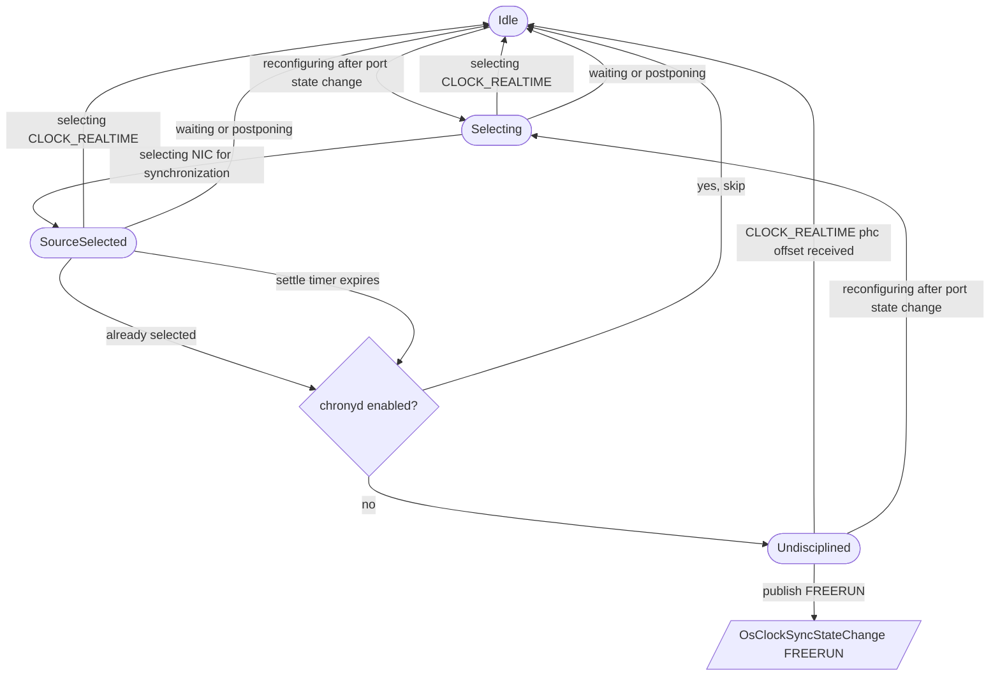

# OS Clock Discipline State Machine

When phc2sys runs with `-a -r`, it automatically selects clock sinks after
upstream topology changes.  If it stops selecting CLOCK_REALTIME as a sink,
the system clock is no longer network-disciplined but the synchronisation
state can remain reported as LOCKED.  This state machine detects that
condition and publishes a FREERUN event.

## Phases

| Phase | Description |
|---|---|
| **Idle** | No selection window is open. This phase does not imply the clock is disciplined — it only means the state machine is not actively tracking a selection burst. Actual discipline is determined by the normal offset processing path. |
| **Selecting** | A window opened after phc2sys logged "reconfiguring after port state change". Waiting for selection lines. |
| **SourceSelected** | A source clock (network interface) was selected, but CLOCK_REALTIME has not been selected as a sink. A settle timer is running. |
| **Undisciplined** | CLOCK_REALTIME is confirmed not network-disciplined. A FREERUN event has been published. |

## Transitions

## Triggers

Each transition is triggered by a specific phc2sys log line:

| Log line | From | To | Action |
|---|---|---|---|
| `reconfiguring after port state change` | Any | Selecting | Opens a new selection window. Increments the generation counter. |
| `selecting <NIC> for synchronization` | Selecting, SourceSelected | SourceSelected | Records that a source clock was selected. Arms (or re-arms) the settle timer. |
| `selecting CLOCK_REALTIME for synchronization` | Any | Idle | CLOCK_REALTIME is being disciplined. Cancels the settle timer. |
| `<NIC> as domain source clock` | SourceSelected | SourceSelected | Mid-burst marker. Re-arms the settle timer. |
| `<NIC> as out-of-domain source clock` | SourceSelected | SourceSelected | Mid-burst marker. Re-arms the settle timer. |
| `source clock not ready, waiting` | Selecting, SourceSelected | Idle | Selection is incomplete. Aborts the window. |
| `multiple source clocks available, postponing sync` | Selecting, SourceSelected | Idle | Selection is incomplete. Aborts the window. |
| `no PHC ready, waiting` | Selecting, SourceSelected | Idle | Selection is incomplete. Aborts the window. |
| `already selected` (without CLOCK_REALTIME offset) | Selecting, SourceSelected | Undisciplined (if SourceSelected) or Idle | Selection burst ended. Publishes FREERUN if a source clock was seen without CLOCK_REALTIME. |
| *(settle timer expires)* | SourceSelected | Undisciplined | No further selection lines arrived. Publishes FREERUN. |
| `CLOCK_REALTIME phc offset ...` | Any | Idle | A system clock offset sample proves discipline. Clears any open window or undisciplined state. |

## Settle Timer

After a network interface is selected, a 200 millisecond settle timer starts.
If CLOCK_REALTIME is selected or an "already selected" line arrives before the
timer fires, the timer is cancelled.  If the timer fires without interruption,
the window finalises and a FREERUN event is published.

The timer carries a generation counter.  If a new "reconfiguring" line opens a
fresh window before the old timer fires, the generation will not match and the
stale callback is discarded.

## Concurrency

All phase transitions are serialised by a mutex internal to the state machine.
The settle timer callback runs on a separate goroutine and acquires the
extract-metrics mutex before finalising, preventing races with the main log
processing path.
